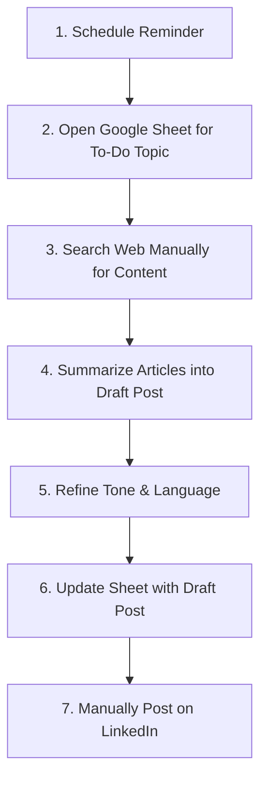

# 🚀 LinkedIn Content Creator — Automate with n8n

This project automates the end-to-end **LinkedIn content creation process** using **n8n, Google Sheets, Tavily API, AI Agents, and LinkedIn Publishing**.  
It transforms the manual effort of researching topics, drafting, and posting into a **fully automated workflow**.

---

## 🔧 Tools & Technologies Used
1. **[n8n](https://n8n.io/)** → Workflow automation platform  
2. **[Google Sheets](https://workspace.google.com/products/sheets/)** → Topic and task storage  
3. **[Tavily API](https://tavily.com/)** → Smart web search for article insights  
4. **AI Agent (LinkedIn Post Architect)** → Creates professional LinkedIn posts  
5. **[LinkedIn API](https://learn.microsoft.com/en-us/linkedin/)** → Automated publishing to LinkedIn  

---

## 🖼️ n8n Workflow
  

---

## 📊 Manual Process Wireframe

Before automation, the **manual process** looked like this:  



## ⚙️ Automated Workflow Steps (n8n)

### **Step 1: Schedule Trigger**
- Starts the workflow on a defined schedule (daily/weekly).  

---

### **Step 2: Get First Matching Row (Google Sheets)**
- **Document:** `1.3 LinkedIn Topics`  
- **Sheet:** `Sheet1`  
- **Filter:** `Status = To Do`  

**Output Example:**

**row_number: 3**
**Topic: AI in Everyday Life**
**Status: To Do**
**Category: Tech & Innovation**

---

### **Step 3: Tavily Web Search (Content Fetch)**
- **Endpoint:** `https://api.tavily.com/search`  
- **Method:** `POST`  

**Sample JSON Body:**
```json
{
  "query": "Search the web for {{ $json.Topic }}",
  "topic": "general",
  "search_depth": "basic",
  "chunks_per_source": 3,
  "max_results": 3,
  "days": 7,
  "include_answer": true
}
```
***Example Query: "Search the web for AI in Everyday Life"***
**Output: 3 summarized articles for the topic.**

---

### **Step 4: LinkedIn Post Architect (AI Agent)
System Prompt used:
```
# Overview
You are an AI agent responsible for creating concise, professional LinkedIn posts based on three provided articles. 
The post should be inspiring, easy to read, and aligned with LinkedIn’s professional community standards.

## Instructions
1. Read and analyze the three provided articles.
2. Identify a common theme or takeaway that unites the articles.
3. Craft a concise LinkedIn post (100–180 words).
4. Tone: Professional, inspiring, thought-leadership.
5. Add 3–5 relevant hashtags.
6. Add 1–3 relevant emojis.
7. Ensure the writing is polished, professional, and audience-focused.

## Example
Input: Articles on AI in Healthcare  
Output:  
"AI is not just transforming industries—it’s saving lives. From early detection to personalized care, healthcare is being revolutionized. 🌍💡  
#AI #HealthcareInnovation #FutureOfWork"
```
---

### **Step 5: Update Google Sheet**
- Updates the same row in Google Sheets with:  
  - **Status:** `Created`  
  - **Content:** `{{ $json.output }}` (AI-generated post)  

---

### **Step 6: Publish LinkedIn Post**
- Uses LinkedIn API to auto-publish the generated post.  
- Final post appears live on your LinkedIn profile/page. 

## 📂 Free n8n Template

You can download and import the **free n8n workflow template** for this project here:  
👉 [Download Template](https://github.com/SachinSavkare/LinkedIn-Content-Creator-Automate-with-n8n/blob/main/1.3%20LinkedIn%20content%20Creator%20(Tavily).json)  

### How to Import in n8n
1. Open your **n8n dashboard**.  
2. Click on **Workflows → Import from File**.  
3. Select the exported `.json` template file.  
4. Add your credentials:
   - **Google Sheets API**
   - **Tavily API Key**
   - **LinkedIn API Credentials**
5. Save & run the workflow to start automating your LinkedIn posts.

## 📑 Project Presentation (PPT)

👉 [Download the PPT here](https://github.com/SachinSavkare/LinkedIn-Content-Creator-Automate-with-n8n/blob/main/1.3%20Linkedin%20Content%20Creator.pptx)


